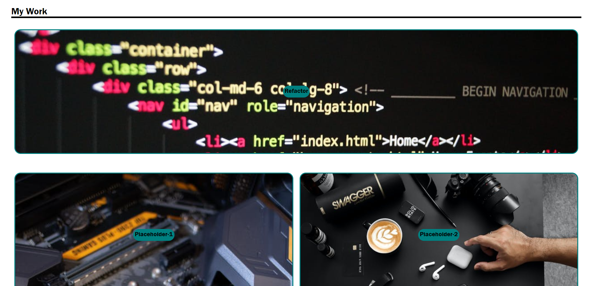
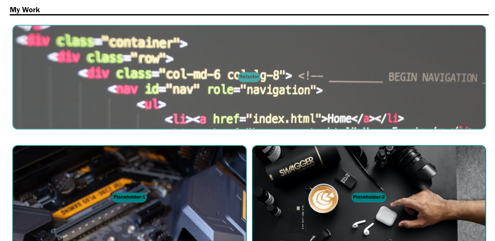

# Challenge-2-Portforlio

## Description

The goal of this assignment was to create a portfolio website to showcase our work for potential future employers. The functionality that was desired to be implemented was:

- A navigation bar with links to ‘About Me’, ‘My Work’ and ‘Contact Me’ sections.
- Clickable image links to live deployment of projects to be showcased.
- Altering the image links when hovered over to show
- Having the first image link larger than the others to draw attention to our best work
- The ability to re-size the page and still maintain functionality and continue to be visually appealing

## Live Deployment link

The live deployment of the site can be found at: https://pletzjd.github.io/Challenge-2-Portforlio/

## Usage

The main functionalities of the site are:

- The nav bar at the top right and which links to the corresponding sections on the webpage.

- The image links which change as you hover over them

## Credits

List your collaborators, if any, with links to their GitHub profiles.

If you used any third-party assets that require attribution, list the creators with links to their primary web presence in this section.

If you followed tutorials, include links to those here as well.

## License

Site developper(s):
- Jordan Pletzer: https://github.com/pletzjd

## License

MIT License

Copyright (c) [2022] [Jordan Daniel Joseph Pletzer]

Permission is hereby granted, free of charge, to any person obtaining a copy
of this software and associated documentation files (the "Software"), to deal
in the Software without restriction, including without limitation the rights
to use, copy, modify, merge, publish, distribute, sublicense, and/or sell
copies of the Software, and to permit persons to whom the Software is
furnished to do so, subject to the following conditions:

The above copyright notice and this permission notice shall be included in all
copies or substantial portions of the Software.

THE SOFTWARE IS PROVIDED "AS IS", WITHOUT WARRANTY OF ANY KIND, EXPRESS OR
IMPLIED, INCLUDING BUT NOT LIMITED TO THE WARRANTIES OF MERCHANTABILITY,
FITNESS FOR A PARTICULAR PURPOSE AND NONINFRINGEMENT. IN NO EVENT SHALL THE
AUTHORS OR COPYRIGHT HOLDERS BE LIABLE FOR ANY CLAIM, DAMAGES OR OTHER
LIABILITY, WHETHER IN AN ACTION OF CONTRACT, TORT OR OTHERWISE, ARISING FROM,
OUT OF OR IN CONNECTION WITH THE SOFTWARE OR THE USE OR OTHER DEALINGS IN THE
SOFTWARE.